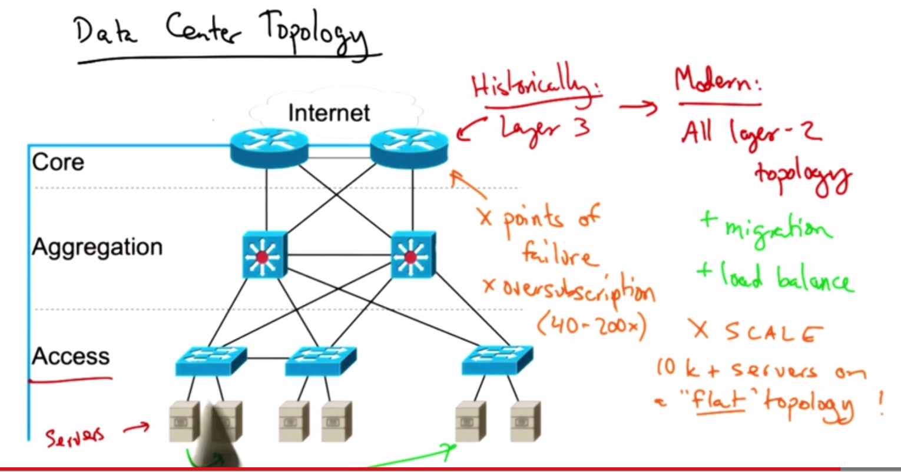
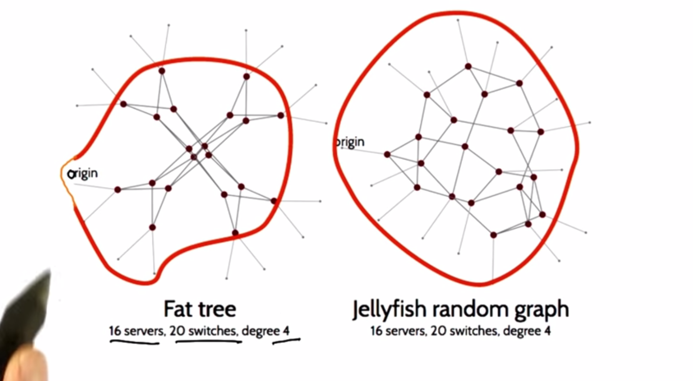

# Traffic Engineering
 - process of reconfiguring the network in response to changing traffic loads to achieve some operational goal.
* maintain peering rations
* relieve congestion
* balance load

### IP Networks Must Be Managed
* Self-management: TCP, Routing
* Problem: Does the network run efficiently?
* How should routing adapt to traffic?
  * Avoid congested links
  * Satisfy application requirements

## Intradomain TE: Tuning Link Weight
* Routers flood information to learn topology
* Operator can configure link weights to affect the shortest path and essentially control the path of traffic in the network
* Can set weights:
  * Inversely proportional to capacity
  * Proportional to propagation delay
  * Network-wide optimization

### Measuring Modeling & Controlling
* Measure topology and traffic
* Feed measurements to a "What if" model to determine what would happen based on certain configuration.
* Implement best changes

## Intradomain TE: Optimization
* Input: Graph G(R-set of routers,L-links)
  * each L has a fixed capacity
  * Traffic matrix: Mij - traffic from router i to router j
* Output:
  * Set of link weights Wl
* Objective Function
  * Cost of congestion increases in quadratic-like manner as loads on links increase
  * Utilization = Ul/Cl
  * Objective = min Sum(f(Ul/Cl))
  * no real simple or rule of thumb way to optimize
  * Practice:
    * Minimize # of changes to network
    * Robust to measurement noise
    * Resistant to failure
    * Limit frequency of changes to network

## Intra vs. Interdomain Routing/TE
* Intradomain: within a domain (isp, campus, datacenter, etc)
* Interdomain: routing *between* domains

## Interdomain TE
* Alleviating congestion on edge links
* Using new/upgraded edge links
* Changing end-to-end path
* Requires reconfiguration of BGP policies

### Goals for Interdomain TE
1. Predictability
  * no globally visible changes
2. Limit influence of neighbors
  * consistent advertisements, limit AS path
3. Reduce overload of routing changes
  * group prefixes according to common AS path

### Multipath Routing
* intradomain:
  * equal cost multipath - set equal link weights on different paths

### Datacenter Networking
* Characteristics of datacenters
  1. Multi-tenancy
    *  + amortization of cost
    *  - security, resource isolation
  2. Elastic resources
  3. Flexible service mangement
    * workload movement and vm migration

### Challenges
* Traffic load balancing
* Support for VM migration
* Power savings
* Security
* 
* X Scale - 10000+ servers on a "flat" topology
  *  results in huge forwarding tables
  * **Pods**
    1. each pod has a mac address
    2. each server has a "pseudoMAC" address corresponding to pod
    3. This decreases the size of forwarding tables
    4. Problem is servers respond to ARP with real MAC instead of pseudoMAC
    5. Solution is to intercept ARP & forwards to fabric manager
    6. Fabric Manager sends switch pseudoMAC for the server and switch then forwards that out

### Data Center TE
* Limited server-to-server capacity
  * links at "top" of fat tree topology are over-subscribed
* Fragmentation of resources
  * reducing fragmentation is complicated reconfiguration on both Layer 2 & 3
  * need Abstraction of BIG L2 Switch
  * enter **VL2**
* VL2
  1. achieve L2 semantics across LAN topology
    * done with name-location separation & resolution service
  2. relies on flow-based random traffic indirection
* Valiant Load Balance
  * Goals:
    1. Spread traffic
    2. Location independence

### Jellyfish: Networking Data Centers Randomly
* Goals:
  * High throughput -> Big data
  * Incremental expandability -> Easy replacement of servers
* Problem:
  * Structure constrains expansion
    * Hypercube: 2k switches
    * 3-level Fat Tree: 5k2/4 switches
* Random Regular Graph
  * randomly selected from regular graphs
  * each node has same degree
  * switches are nodes
  * Example
    * 432 servers
    * 180 switches
    * degree 12
    * ki total parts
    * ri to connect to other Topographic switches
    * ki - ri to servers
    * N(ki - ri) servers
    * RRG(N,k,r)
* **Constructing Jellyfish**
  1. Pick a random switch pair
    * must have free ports and not be neighbors
  2. Join them with link 
  3. Repeat until no more links can be added
  4. If switch remains with ≥ 2 free ports, switches can be added by removing random existing link and adding links to new switch.
* 
* Topology Design
  * How close are random graphs to optimal?
  * What about heterogeneous designs?
* System Design
  * Physical cabling?
  * Routing?
