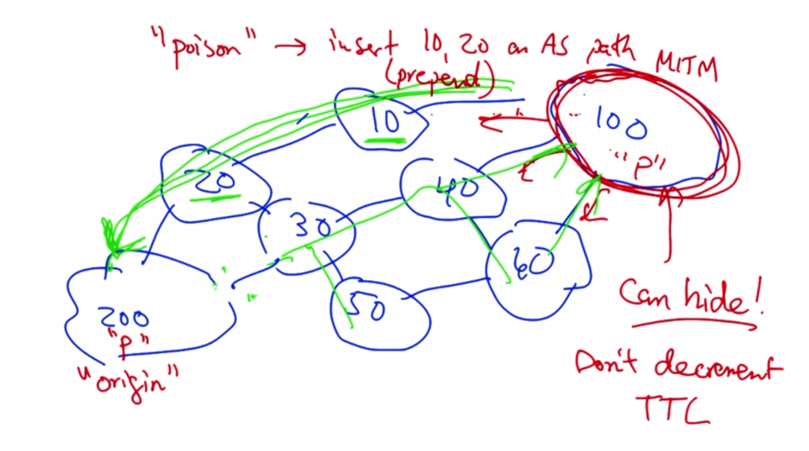
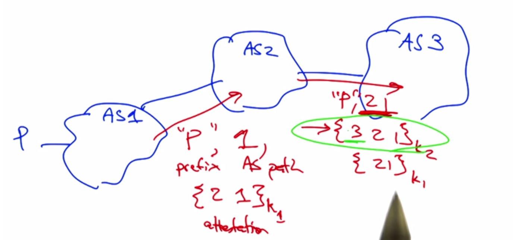
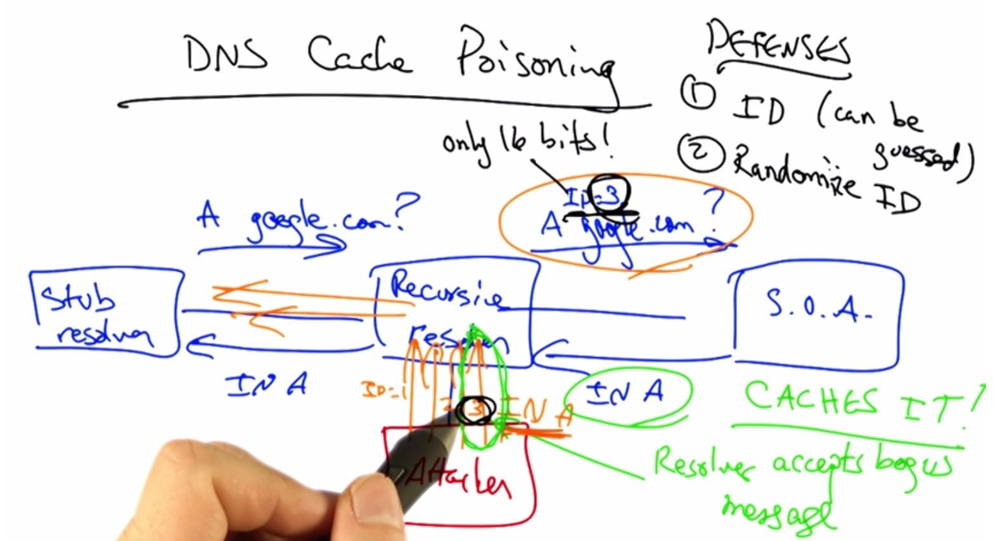

# Network Security Intro

### Why do we need security?
* Attacks:
  * Routing
    * 4/8/10: China advertises 50,000 IP prefixes from 170 countries
    * 2/24/08: Pakistan "hijacked" YouTube prefixes in attempt to block domain
    * 1/22/06: ConEdison "hijack"
    * 4/25/95: AS7007 advertised ALL existing prefixes on internet as originating on its network.
  * Naming (DNS):
    * Reflection - generates large amounts of traffic (DDOS)
    * PHishing - exploit domain name
* Internet Design is fundamenally insecure
  * designed for simplicity not security
  * "On by default" - any host should always be reachable
  * Hosts are inherently insecure also
  * Attacks can look like normal traffic
  * Federated design

### Packet Switching: Resource Exhaustion
* Links can contain traffic from multiple senders simultaneously
* Vulnerable to resource exhaustion attacks

## Components of Security
* Availability: ability to us a resource
* Confidentiality: concealing information
* Authenticity: assuring origin of information
* Integrity: prevent unauthorized changes

### Attack on Confidentiality:
* Eavesdropping
  * packet sniffers (wireshark, tcpdump) put NIC in promisuous mode
    * DNS packets 
    * Packet headers
    * Payloads

### Attack on Authenticity:
* Man in Middle
  * Capture packets and inject packet replacements in flow

## Routing Security (BGP)
1. Control Plane Authentication
  * Session: point-to-point between routers
  * Path: protects AS path
  * Origin: protects origin AS, guaranteeing that origin AS is indeed ower of advertised prefix
    * Route Hijacks

### Attacks on routing
* How?
  * configuration error
  * router can be compromised by unauthorized attacker
  * unscrupulous ISPs advertising wrong routes
* Types?
  * reconfigure router - most common
  * tamper with software
  * tamper with routing data

* 

### Session Authentication
* AS1 authenticates with AS2 via TCP connection
  * uses MD5 hash of message + shared key
  * keys are manually shared and configured
* AS1 can transmit packets with TTL of 254
  * AS2 drops any packets with TTL < 254

### Guaranteeing Origin & Path Authentication
* Secure BGP (BGPSEC)
  * Origin Attestation:
    * Certificate binding prefix to owner, signed by trusted party
    * Address attestation
  * Path Attestation:
    * Signatures along AS Path

### Path Attestation
* Path AS1 - AS2 - AS3
  * ki = private key of ASi
  * 
* can prevent:
  * Hijacks
  * Path Shortening
  * Modification
* cannot prevent:
  * Route Suppression
  * Replay attack

### DNS Security
* Intercept query from stub
* Caching resolver poisoning
* Masters and slaves can be spoofed
* zone file corruption

### Why is DNS vulnerable?
* Resover always trust responses.
* Responses can contain info unrelated to query
* *NO AUTHETICATION*
* *Use UDP*

* **Kaminski Attack** - flood caching resolver with A Record queries and stuff the bogus response with a corrupt NS record to poison the cache

### Defenses to Cache Poisoning
* ID + Randomization
* Source port randomization
  * resource intensive
  * NAT can derandomize
* 0x20 encoding -> dns is case insensitive
  * randomly change case of domain characters
  * adds additional entropy

### DNS Amplification Attack
* Expoloits asymmetry in size between queries & responses
  * query is 60bytes, response is 3000bytes
  * basically a dns dos
* Defenses:
  * Prevent IP spoofing
  * disable open resolvers

### Authentication: DNS SEC
* Referral from root server sends IP and Public Key in a signature
* resolver has public key and can authenticate root response
