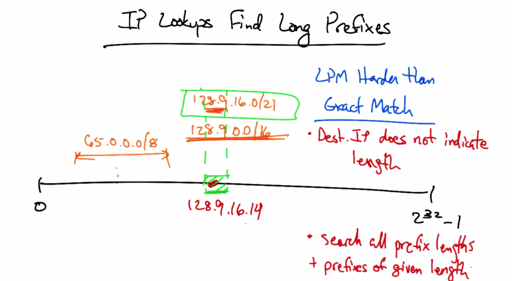
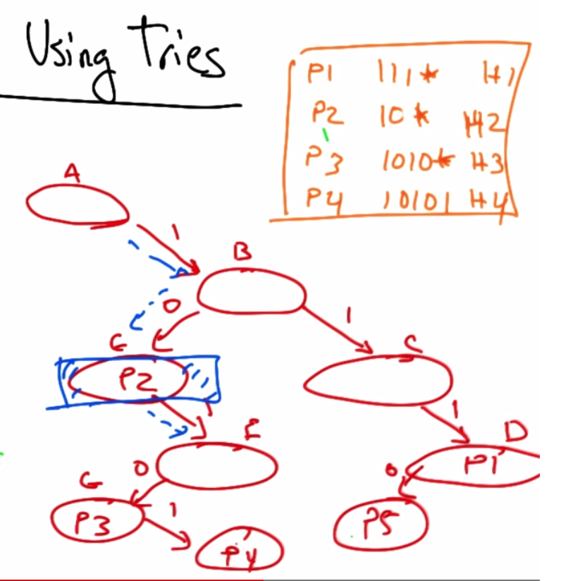
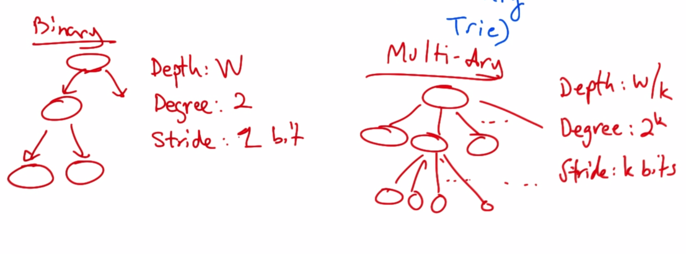
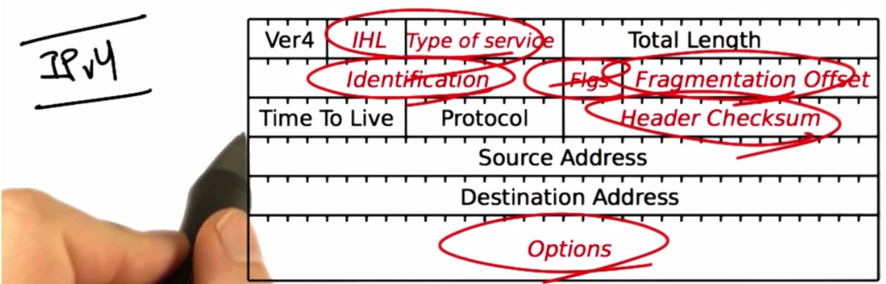
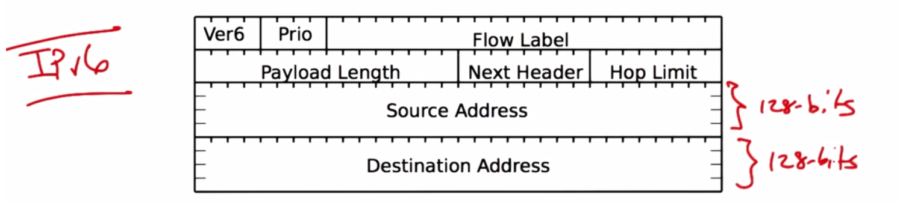

# IP Addressing
## IPv4 structure and allocation
* IP = Internet Protocol
* 32-bit number formatted in dotted quad notation
* each quad consists of an 8-bit string

|  130   |  207   |   7    |  36    |
|:------:|:------:|:------:|:------:|
|10000010|11001111|00000111|00100100|

* there are 232 = 4 billion addresses

### Pre 1994: Classful Addressing
* Class A: 8-bits NetID, 224 Host ID
* Class B: 16-bits NetID, 216 Host ID
* Class C: 24-bits NetID, 8 for Host ID
* **Starting to run out of Class C addresses around 1994**

### IP Address Allocation
* Central
* ARIN
* Ripe NCC
* APNIC
* LACNIC
* AfriNIC
* Defined
* Multicast
* Experimental
* IANA
* **whois -h whois.ra.net ip address**

### CIDR - Classless Inter Domain Routing

* 32 bits: IP Address + "Mask"
* Example 65.14.248.0/22
* Mask length = Network ID
* Problem - Possible to have overlapping address spaces
* 65.14.248.0/24 overlaps above example
* If overlapped entries are discovered, longer mask length prevails

* *Longest Prefix Match*
* each packet has dest. IP
* Router looks up table entry that matches that address
* 
  * If dest. address is found in multiple ip networks, router chooses network with longest mask.
* CIDR resulted in drastic increase in routing

* *Multihoning*
  * Frustrates Aggregation
  * 

* *Longest Prefix Match (LPM) to control Inbound Traffic*
  * A - 10.1.0.0/16 advertises to B & C
  * B & C in turn advertise to D
  * To balance load, A could advertise 10.1.0.0/17 to B and 10.1.128.0/17 to C
  * This will allow 10.1.128.x to traverse thru C and 10.1.0.x to traverse thru B
  * Allowing essentially 1/2 of traffic to 10.1.0.0/16 to go thru B & 1/2 thru C

### Lookup Tables & How LPM Works
* Exact match vs. LPM
* IP Address Lookup 
* Implementation of LPM using Tries

* Lookup Algorithm depends on protocol
  * MPLS, Ethernet, ATM use Exact Match via Direct lookup, Associative lookup, hashing, and binary tree
    * inefficient use of memory
  * IPv4, IPv6 use LPM via Radix trie, compressed trie, binary search or prefix int.
  * 
 
* LPM in IPv4: Exact match
  * extremely inefficient because you have to store every length in a table and forward each packet to each table

* Address Lookup Using Tries
* *Single Bit Trie*  
* Prefixes "spelled out" by following path to root
  * To find the best prefix, spell out the address in a trie
  * 
  * 32 bit address might require 32 separate lookups
* *Direct Trie*
  * 1 memory access can make up multiple lookups
  * inefficient use of memory
* *Memory Efficiency + Fast Lookup*
  * Multi-bit Trie ("Multi-Ary" Trie)
  * 
* *4-ary Trie (k=2)*

### Alternatives to LPM w/ Tries
* Content Addressable Memory (CAM)
  * input: tag, output: value
* Ternary CAM (0, 1, *)
  * permits implementation of LPM

## NAT and IPv6

**Problem: IPv4 has only 32 bits (only 232 addresses*
  * essentially, we have already run out of addresses

## NAT
* Allows multiple networks to reuse the same private IP address space
* RFC 3130 - lists reserved private address spaces
* Only edge device has a public address. 
* It receives packet and translates it to private address, and vice versa from internal traffic
* Breaks the End-to-End model... if NAT fails, end point is unreachagle

## IPv4 -> IPv6
* Structure:
  * 
  * 
* Top 48 bits:public routing topology
  * 3 aggregation, 13 tier 1 ISP, 8 reserved, 24 additional
* 16-bit site identifier
* 64-bit interface ID
  * 48-bit Ethernet + 16 more bits
* More addresses
* simpler leader
* multihoning
* security features built in

## Incremental Deployment of IPv6
* difficult because most traffic depends on IPv4 "narrow waist"
* Dual Stack
  * host speaks both IPv4 & IPv6
  * Must have 2 IP addresses configured or have software translator
  * can embed IPv4 address in IPv6 address
* 6 to 4 tunneling
  * v6 packet is encapsulated in a v4 packet
  * v4 packet is routed to a v4 to v6 gateway and encapsulation is stripped and v6 packet is delivered to v6 host.
