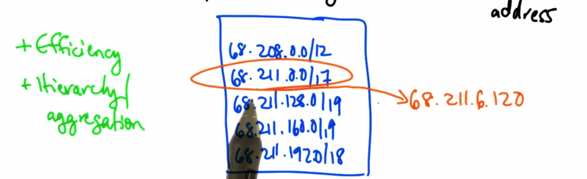
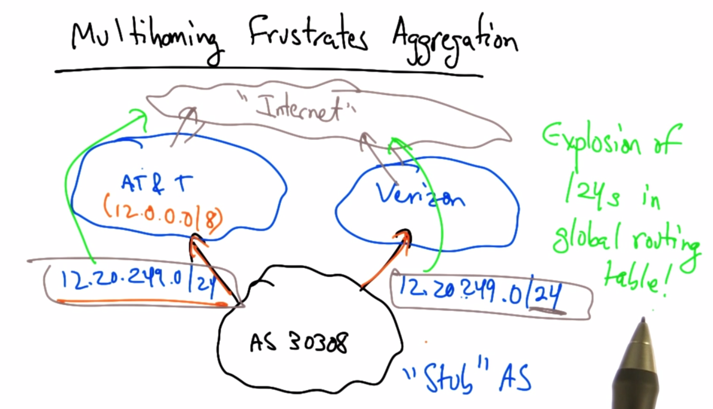

# IP Addressing
## IPv4 structure and allocation
* IP = Internet Protocol
* 32-bit number formatted in dotted quad notation
* each quad consists of an 8-bit string

|  130   |  207   |   7    |  36    |
|:------:|:------:|:------:|:------:|
|10000010|11001111|00000111|00100100|

* there are 232 = 4 billion addresses

### Pre 1994: Classful Addressing
* Class A: 8-bits NetID, 224 Host ID
* Class B: 16-bits NetID, 216 Host ID
* Class C: 24-bits NetID, 8 for Host ID
* **Starting to run out of Class C addresses around 1994**

### IP Address Allocation
* Central
* ARIN
* Ripe NCC
* APNIC
* LACNIC
* AfriNIC
* Defined
* Multicast
* Experimental
* IANA
* **whois -h whois.ra.net ip address**

### CIDR - Classless Inter Domain Routing

* 32 bits: IP Address + "Mask"
* Example 65.14.248.0/22
* Mask length = Network ID
* Problem - Possible to have overlapping address spaces
* 65.14.248.0/24 overlaps above example
* If overlapped entries are discovered, longer mask length prevails

* *Longest Prefix Match*
* each packet has dest. IP
* Router looks up table entry that matches that address
* 
  * If dest. address is found in multiple ip networks, router chooses network with longest mask.
* CIDR resulted in drastic increase in routing

* *Multihoning*
  * Frustrates Aggregation
  * 

* *Longest Prefix Match to control Inbound Traffic*
  * A - 10.1.0.0/16 advertises to B & C
  * B & C in turn advertise to D
  * To balance load, A could advertise 10.1.0.0/17 to B and 10.1.128.0/17 to C
  * This will allow 10.1.128.x to traverse thru C and 10.1.0.x to traverse thru B
  * Allowing essentially 1/2 of traffic to 10.1.0.0/16 to go thru B & 1/2 thru C

