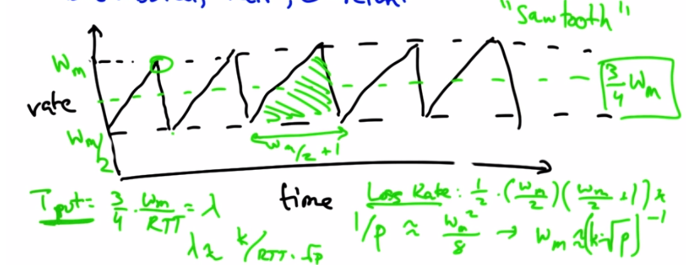

# Congestion Control

**Congestion Control:** Fill the internet pipe without overflowing
If pipe starts getting congested... slow down traffic

### Congestion
* Different sources compete for resources
  * sources are unaware of each other & of current states
  * Can result in lost packets and long delays
  * 

### Congestion Collapse
* *Increase* in load -> *decrease* in useful work
  * Spurious retransmission
  * Undelivered packets

## Goals of Controlling Congestion
1. Use network resources efficiently
2. Preserve fair allocation of resources
3. Avoid Congestion Collapse

### 2 approaches
1. End-to-End
  * No feedback from network
  * Congestion inferred by loss & delay
2. Network-assisted
  * Routers provide feedback
    * single bit
    * explicit rates

## TCP Congestion Control
* Senders increase flow until packets start dropping
* TCP interprets packet loss as congestion and slows flow down
  * Packet loss is not always because of congestion
* *Increase Algorithm*
* *Decrease Algorithm*

### Window Based algorithm - most common
* Sender only has certain # of "in-flight" packets
* Cannot send more packets until sender gets an ACK from the receiver
* To increase rate of flow, increase the window size
  * window size is the # of in-flight packets that can be allowed
* When ACK is not received, window size is reduced by half
* **Additive Increase, Multiplicative Decrease - AIMD**

### Rate Based algorithm
* Sender monitors loss rate
* Uses timer to modulate flow

### Fairness and Efficiency
1. Fairness: everyone gets their fair share of available bandwidth
2. Efficiency: network resources are used well
  * Phase Plot
  * 
  * AIMD: converge to fairness and efficiency
    * When Additive Increase is applied, efficiency is increased
    * When Multiplicative Decrease is applied, fairness is improved

### AIMD
* Distributed, fair, and efficient
* Sawtooth model
  * Rate is increased little by little until packet drop
  * Rate is dropped by half
  * 
    * m = maximum
    * W = Window Size

## Data Centers & TCP "Incast"
* Server racks, switches, and links between all other network elements
  * High "fan-in"
  * High badwidth, low latency
  * Lots of parallel requests - each w/ small amount of data
  * small buffers
* **Incast** - drastic reduction in application thruput that results when many simultaneous TCP reqeusts, leading to underutilization of network capacity
  * Have many bursts and retransmissions
  * Senders must wait on TCP Timeouts

* **Barrier Synchronization & Idle Time**
  * no progress can be made until all parallel threaded requests are answered
  * if you have 4 parallel threads and 3 are ACKed, must wait for TCP timeoout on 4th resulting in idle time
* **Solutions:**
  * fine granularity retransmissions
  * ACKs for every other packet

## Multimedia & Streaming
* Digital Audio/Video Data
* Multimedia applications
* Multimedia transfers over best-effort networks
* QoS

* **Challenges**
  * Large volume of data
  * Data volume varies over time
  * Low tolerance for delay variation
  * Low tolerance for delay - period (some loss is acceptible)

* **Digitizing AV**
  * Audio
    * 
  * Video
    * Image compression - spatial redundancy
    * Compression across images - temporal redundancy
  * Streaming video
    * Server stores a/v
    * Client requests
      *  important to play at "right time"
    * Data must arrive to client quickly
    * Client caches data in a buffer to allow for varied receive rates
    * Delay and small amounts of Loss is acceptable
    * **Variation in delay is not acceptable**

* **TCP is not a good fit for streaming**
  * Reliable delivery
  * Slowing down upon loss
  * Protocol overhead
* **UDP is better for streaming**
  * No retransmission
  * No sending rate adaptation
  * Unreliable delivery

* **More Streaming**
* YouTube
  * uploaded videos converted to flash or HTML5
  * HTTP/TCP are implemented in every browser
  * Requests are redirected to CDN near client
  * CDN server responds with video stream
* Skype/VOIP
  * analog signal is digitized - A-D conversion
  * Skype software digitizes
    * Central login server
    * Uses P2P - which uses peers to route traffic
    * Compression - 67 bytes/packet
    * 40kbps each direction
    * signal is encrypted
    * Delays, congestion and delays degrade experience
    * QoS - policing and marlking packets as "more important"
  * Vonage has hardware that analog phone plugs into that does digitizing

### QoS
* Apps compete for bandwidth
  * VOIP & FTP on same link
  * Delay is more acceptable in FTP
    * *Common*
      * Marking VOIP packets with higher priority
      * Scheduling to serve higher priority streams more often
    * *Uncommon*
      * Fixed bandwith allocations - inefficient
      * Admission Control - busy signal on phone

## Parking Lot Problem
* [Parking Lot Assignment](https://www.youtube.com/watch?v=ZTQgPSE3NWg)
* Collapse occurs when packets consume resources then are dropped later and no useful communication occurs
* Become familiar w/ Mininet & custom topologies
* Programs in virtual hosts
* Learn about TCP
  * sawtooth
  * bandwidth sharing
* N = number of receivers connected via switchlike topology
* link speed - 100Mbps
* delay - 1ms
* fill in gaps in parkinglot.py

