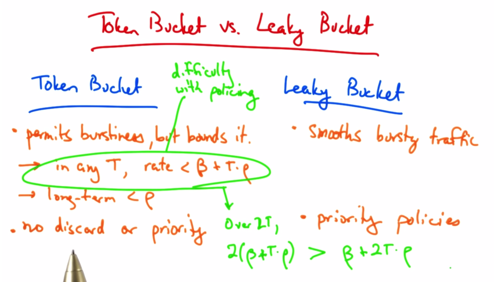
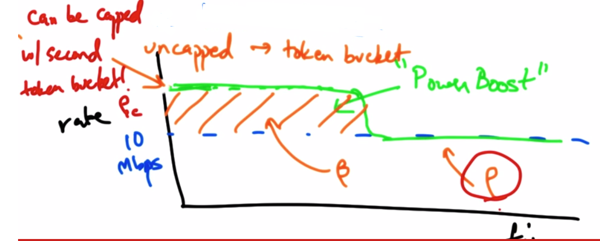
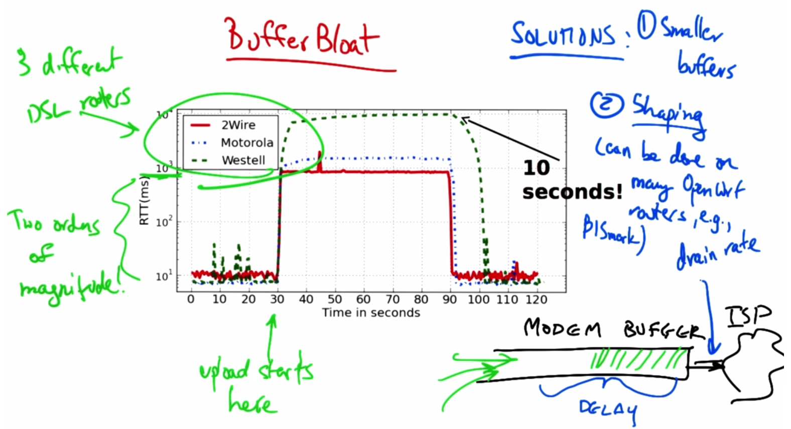

# Traffic Classification and Shaping

### Ways to classify traffic

* Classification of sources
  * Data: bursty, periodic, regular
  * Audio: continuous, periodic
  * Video: continuous, bursty, periodic
* Two Classes
  1. CBR (Constant BitRate)
    * traffic arrives at regular intervals with same packet sizes
    * Audio
    * Shaped according to peak rate
  2. VBR (Variable BitRate)
    * traffic arrives at variable intervals
    * Video, data
    * Shaped according to average rate

### Traffic Shaping approaches

1. Leaky Bucket - one bucket per flow
  * Data arrives in bucket of size ß
  * p = drain rate
  * Max avg rate is p
  * regulator at bottom of bucket makes sure burst doesnt exceed bucket size
    * Audio:
      * ß = 16kb
      * packet size = 1kb
        * can accumulate a burst of 16 packets in the bucket
      * p = 8 packets per sec (avg)
        * ensures that rate is smoothed to avg rate not to exceed 8KBps
2.  (r,T) Traffic Shaping
  * traffic divided into T-bit frames.
  * Flow can inject ≤ r bits in any T-bit frame
  * (r,T) smooth
  * flow can send excess data in bits instead of packets 
  * priorities can be set by sender or network
3.Token Bucket - Shaping Bursty Traffic Patterns
  * ß = bucket size
  * p = rate at which tokens are placed in bucket
  * traffic can be sent by regulator as long as there are tokens in ß
  * packet size b < ß
  * if ß is full, Packet is sent and b tokens are removed
  * if ß is empty, packet must wait until b tokens arrive
  * if partially full:
    * if < b packets in ß, packet has to wait
    * if ≥ b packets in ß, packet is sent

## Token Bucket vs. Leaky Bucket

* Policing with Token Buckets (Composite Shaper)
  * combining leaky bucket and token buckets
  * smooths traffic, but requires 2 counters

**Power Boost** deployed June 2006 by Comcast
* Allows subscriber to send at higher rate for a brief time
* Uses spare capacity created by users who are no utilizing their full bandwidth
* 2 types:
  1. capped - boosting speed has a limit
  2. uncapped - no limit
* 

**Calculating Powerboost Rates**
* sending rate r > Rsustained
* Powerboost bucket size: ß
* d = length of time user can send at boosted rate
* ß = d(r-Rsus)
* d = ß/(r-Rsus)
* [BISmark - GT's Comcast PowerBoost research](http://projectbismark.net)

**Effects on Latency**
* PowerBoost can cause buffers to fill and result in latency
* Sender can shape rate not to exceed Rsus to limit latency

### Buffer Bloat
* Even though sender can boost at a higher rate, the buffer cannot support the faster rate, so packets build up in buffer, which causes higher delays
* delay = data in buffer/Rsus
* Delays are bad for voice, video, etc
* buffers can occur in Home routers, Home APs, Hosts, Switches, and Routers
* 

### Network Measurement
* How to "see" what traffic is being sent on network
  * *Passive* Measurement: collection of packets, flow stats that are alreadon the network
  * *Active* Measurement: inject additional traffic to measure various characteristics
    * ping, traceroute
* Why measure?
  * Billing
  * Security

**Passive Measurement**
* SNMP (Simple Network Management Protocol)
  * Network Devices provide "Management Information Base" (MIB)
  * SNMP keeps record of Interface Byte & Packet Count
  * SNMP is standard but limited in the amount and types of info
* Packet Monitoring - monitors can see headers or full packet content
* Flow Monitoring - monitor can see stats on particular flows of traffic

**Packet Monitoring**
* Monitors can see headers or full packet content
* tcpdump, ethereal, wireshark
* Downsides
  * High overhead
  * lots of specific details (timing, header info)
  *  hard to keep up with traffic on high bandwidth links

**Flow Monitoring**
* Less detailed than packet monitoring
* Flow shares
  1. src & dest IP
  2. src & dest port
  3. protocol type
  4. TOS byte
  5. interface
* also can contain next hop IP and src/dest AS & prefix
* Less overhead than packet monitoring
* Sampling allows you to "pluck" packets randomly from a flow to analyze
