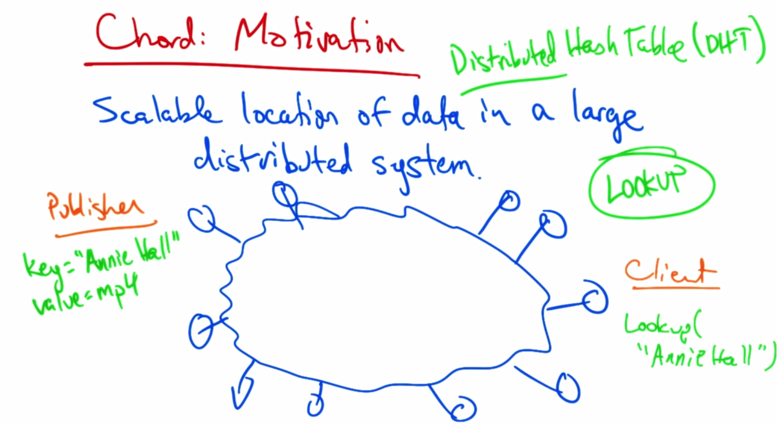

# Content Distribution

## Web and Caching
* HTTP
  * Request -> Response
  * Server is stateless (maintains no connection data, only responds to requests)

* HTTP Requests
  * Request line:
    * Method -> GET, POST, HEAD
    * URL (relative ie: /index.html)
    * Version Number
  * Headers:
    * Referrer -> what caused page to be requested
    * User Agent -> client software (browser)

* HTTP Response
  * Status Line:
    * HTTP version
    * Response code
      * 100s - informational
      * 200s - success
      * 300s - redirects
      * 400s - errors
      * 500s - server error
    * Location
    * Server
    * Allow
    * Content Encoding
    * content Length
    * Expires
    * Last modified

### Early HTTP
* 1 request/response per TCP connection
  * Simple
  * TCP connection for every request
    * 3-way handshake each request
    * Keeps TCP in slow start
    * Servers in TIME-WAIT 

### Persistent Connections
* Multiple request/response on a single TCP connection
  * Delimiters indicate the ends of request
  * Content-length - indicates how long connection should be kept open
* Pipelining
  * Client sends requests as soon as it encounters a referenced object
  * As little as 1 RTT per object

### Caching
* Clients cache documents/objects in:
  * browser (local)
  * network (ISP webcache)
* Caching improves performance by keeping content nearer to the client
* Caches expire periodically and check back with origin of source
  * 304 response is "content not changed"
* Redirects to caches can be accomplished by:
  * browser configuration
  * server directed

### CDNs
* CDN is overlay network of web caches designed to deliver content to client from optimal location
* Geographically disperate servers
* Quite expensive to deploy and implement
* CDNs set up by Content Providers, Networks/ISPs, or stand alone (Akamai)
* **Challenges of CDN**
  * Goal is to replicate content on many servers
  * Server Selection
    * Lowest load
    * Lowest latency
    * Any "alive" server
  * Content Routing
    1. Routing system (anycast)
      * simple but very coarse (not granular)
    2. Application-based (HTTP redirect)
      * Requires each https request to go to origin to get a redirect
      * results in higher latency
    3. Naming-based (DNS)
      * fine-grained control
      * fastest

### CDNs & ISPs -> Symbiotic relationship
* CNDs peer with ISPs
  * Better throughput
  * redundancy
  * burstiness -> lower transit costs
* ISPs peer with CDNs
  * good performance for customers
  * lower transit costs

### Bit Torrent
* Peer-to-peer CDN
  * file sharing
  * Large file distribution
  * If many users request same file from one server, could result in server overload or congestion
  * Large files are broken into smaller pieces and pieces are replicated on peers so that all peers get the full file once replication is complete
* Steps for publishing
  1. Peer creates "torrent"
    * torrent file contains metadata such as the tracker and information on all pieces of file and checksum for pieces
  2. "Seeders" create initial copy of full file
  3. client contacts tracker which provides a list of seeders 
  4. Clients begin swapping chunks of file with each other
  5. a "leecher" is client that contain incomplete copies of file
* Solution fo freeriding: Choking
  * Temporary refusal to upload
  * If a peer can't download from a client, don't upload to it
  * Eliminates freerider problem
  * [Repeated Prisoner's Dilemma](http://www.u.arizona.edu/~mwalker/10_GameTheory/RepeatedPrisonersDilemma.pdf)
* Getting Chunks to Swap
  * rarest piece first
    * determines which pieces are most rare among clients and swap that first
    * random piece first (from seeder)
  * end-game: actively request missing pieces from all peers and redundant requests are deleted when piece arrives

### Distributed Hash Tables 
* Stuctured Content Overlay
  * CHORD
    * Scalable, distributed "lookup service"
      * key -> value lookups (DNS, directories, etc)
      * good scalability
      * proveable correctness
      * good performance
  * Consistent hashing

**Chord motivation**

* Scalable loation of data is a large distributed system
* 
* Consistent Hashing
  * Main Idea: *Keys and nodes map to same ID space*
  * Hash function assigns ID
  * Node: hash(IP Adress)
  * Key: hash(key)
  * Chord:
    * Key stored at successor node
  * load is balanced and flexible
* Implementing consistent hashing
  * **Option:** Every node knows location of every other node
    * lookups are fast but routing tables are large
  * **Option:** Every node knows only successor node
    * routing tables are small, but lookups are slower
  * **Finger Tables** provides "best of both worlds"
    * Every node knows m other nodes
