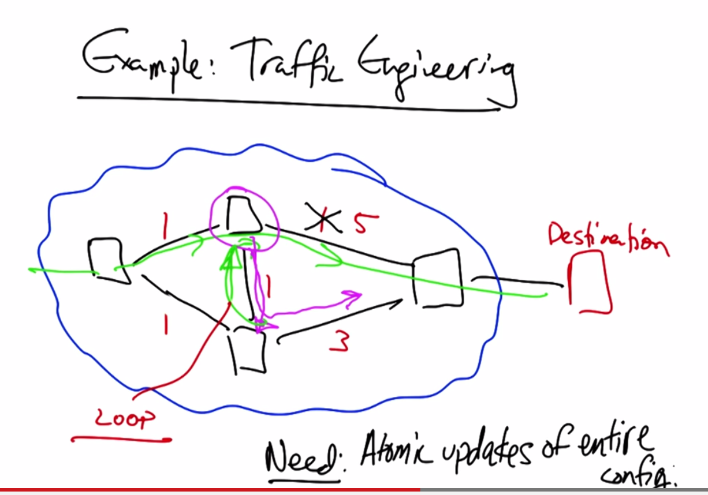
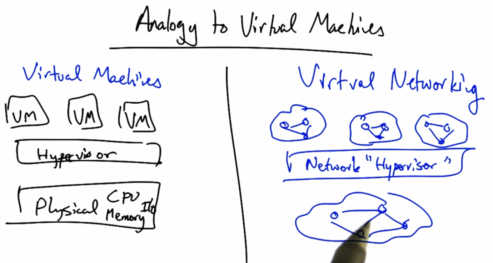
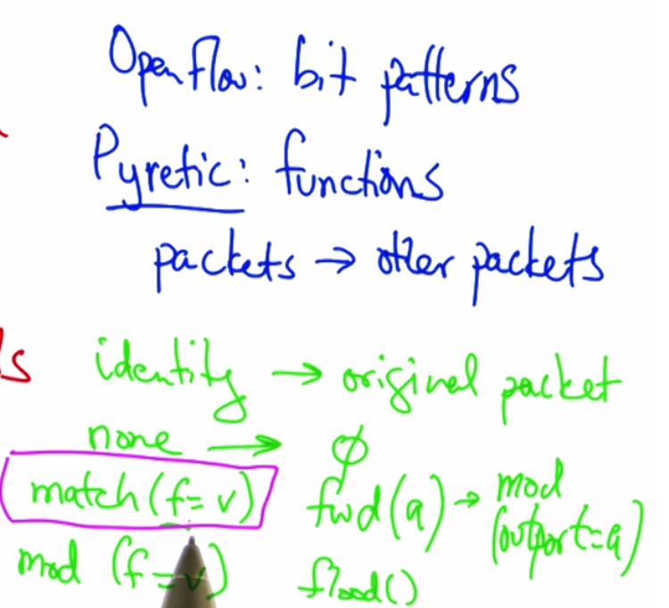

# Consistent Updates in SDNs

### Consistency Problems
* Paket-level: Updates may disrupt packets along an end-to-end path
* Flow-level: Packets from the same flow may be disrupted due to mid-flow update

### 3 Steps in SDN programming
1. Read/monitor network states
  * failures, topology changes, security events, ...
2. Compute Policies based on states
  * decision plane
3. Write Policies

### Reading state problems
* Example: Web server traffic except source 1.2.3.4
  * Solution: Predicates
    * (srcip !== 1.2.3.4) && (srcport == 80)
  * Runtime system translates predicates to low-level openflow rules
* Problem: switches have limite storage space for rules
  * cannot install all possible patterns
  * Solution: Dynamically "unfold" rules as traffic arrives
    * Programmer specify "GroupBy(srcip)"
    * Runtime system dynamically adds rules as traffic arrives
* Problem: Extra Unexpected Events
  * 1st packet goes to controller and controller caches rules on switch
  * What if more packets arrive before rule is installed?
    * Programmer specifies "Limit(1)"
    * Runtime system hides any packets over 1

### Writing Policy Problems
* Maintenance
* Unexpected failure
* Traffic Engineering

* Example: traffic engineering
  * 
  * Solution: Two-Phase Commit
    * packets are tagged with version numbers
    * policies correspond to packet version numbers and old policy is kept until all packets with P1 are gone

### Network Virtualization 
* Abstraction of physical network
  * Multiple logical networks on a shared physical substrate
  * Nodes in physical topology are VMs
  * Links in physical network sliced into tunnels
  * 
* Why Virtual Networking?
  * "Ossification" of Internet architecture.
  * enables evolution by letting multiple architecture exist in parallel
  * Practice: multi-tenant data centers
    * EC2, Rackspace, Google App engines
* Benefits of Network Virtualization
  * Rapid innovation
  * new forms of network control
  * (potentially) simpler programming

### Design Goals for VN
* Flexible
* Manageable
* Scalable
* Secure
* Programmable
* Able to support different technologies

* **Implementation**
* Nodes
  * VMs or Virtual Environments
  * examples: Xen, VMWare, Vservers
* Edges
  * Tunnels
  * Simulate a layer 2 connection even over multiple layer 3 hops
  * encrypt packets on src node and decrypt on dest. node

* **Summary**
  * VNs facilitate flexible, agile deployment
    * Rapid innovation
    * Vendor independence
    * Scale
  * SDNs vs. VNs
  * Technologies: VMs, Tuneling

### Programming SDNs: Why & How?
* Problem: OpenFlow not easy!
  * Low level of abstraction
  * Controller only sees events that switches do not know how to handle
  * race conditions if switch-level rules not installed properly
* Solution: "Northbound" API
  * Higher level API so controller can talk to application & vice versa
  * Vendor independence
  * Exaples: 
    * large virtual switch
    * security apps
    * middlebox integration

### Frenetic: SQL-Like Query Language
* Example:
  * select (bytes)
      where (in: 2 & srcport: 80)
      groupBy(dstMAC)
      every(60).

* Problem with writing at high level of abstraction:
  * Modules affect same traffic
  * Monitors, routes, firewall rules, load balancing applications
  * Composition operators - combine modules to single, coherent, openflow policies

* Policy Composition
  * Parallel: Perform both operations simultaneously
    * counting and forwarding
  * Sequential: Perform one operation, then next
    * firewall rules, then packets that make thru firewall are switched

## Pyretic
* SDN Language and Runtime
* Language: express policies
* Runtime: Compliling these policies to OpenFlow
* Key abstraction: "located" packets
* Network policy as function
* Boolean predicates
* Virtual packet header fields
* Composition operators
* 

* Policy Composition
  * Sequential Composition
    * match(dstIP=2.2.2.8)>>fwd(1)
  * Parallel Composition
    * match(dstIP=2.2.2.8)>>fwd(1) + match(dstIP=2.2.2.9)>>fwd(2)

* Traffic Monitoring
  * Query on packet streams
    * self.query = packets(1,['scrMAC','switch'])
    * self.query.register.callback(learn\_new\_mac)

* Dynamic Policies
  * Timeseries of static policies
    * current value: self.policy

