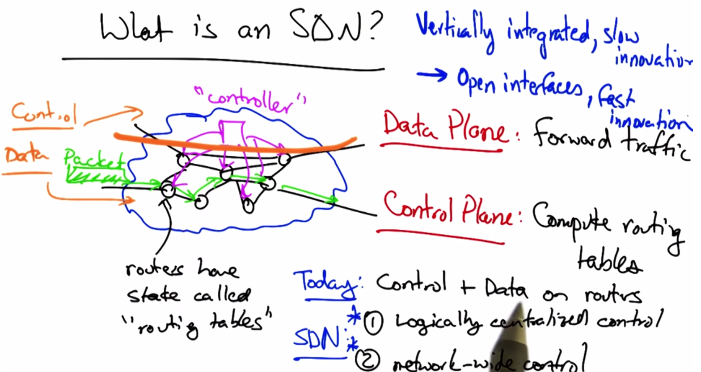
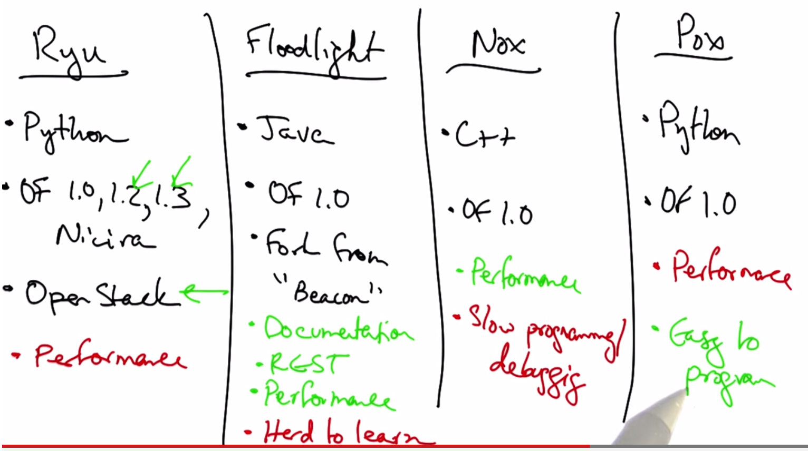
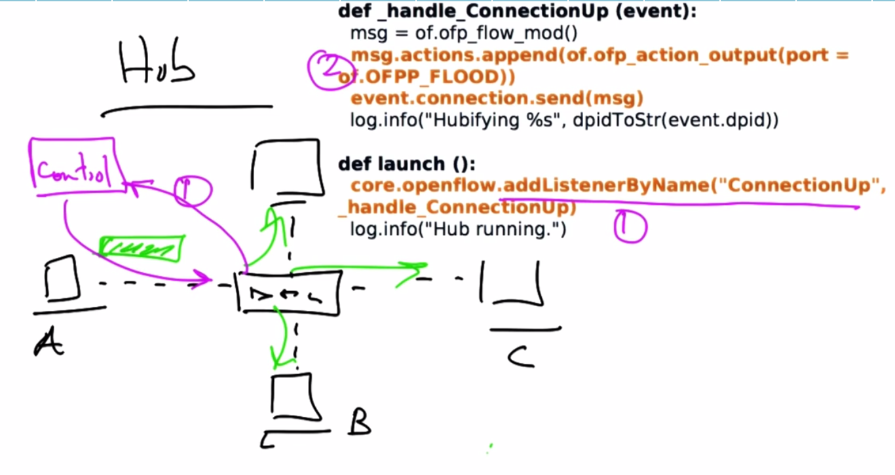
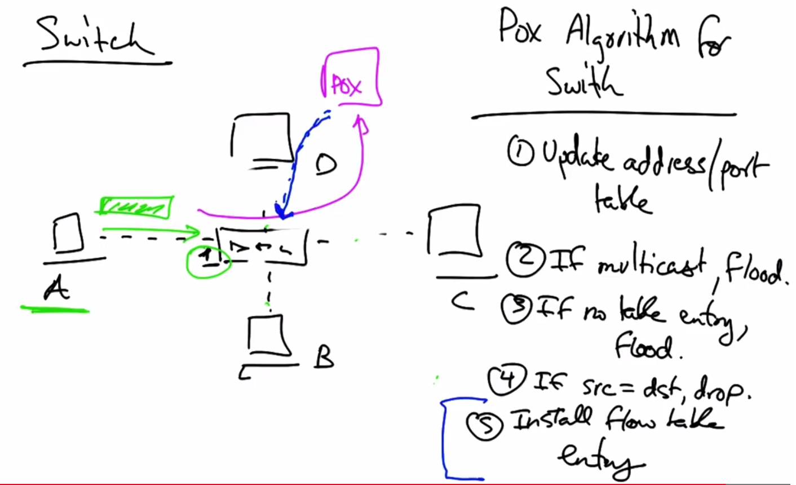

# Software Defined Networking

### Network management
* process of configuring network to achieve a variety of tasks
  * Load Balancing
  * Security
  * Business Relationships
* mistakes in configuration can lead to:
  * Oscillation
  * Loops
  * Partitions
  * "Black Holes"

### Why is configuration difficult?
* Defining *correctness* is hard
* Interactions between protocols leads to unpredictability
* Operators make mistakes
  * Device-level configuraiton

### What operators need (and what SDN provides)
1. Network-wide *views*
  * Topology
  * Traffic
2. Network-level *objectives*
  * Load Balance
  * Security
3. Direct *control*
  * SDN allows operator to write a control program that directly affects data plane

* Routers should 
  * Forward packets
  * Collect measurements
  * Do not need to compute routes 
    * can be logically centralized
* **SDN - removes routing from routers**

## SDN
* What is an SDN?
  * 
* History;
  * Pre-2004: Distributed configuration
  * 2004: Control network from logically centralized controller focused on BGP called Routing Control Platform(RCP)
  * 2005: Generalized RCP to 4 planes
    * Decision plane
    * Data plane
    * Dissemination plane
    * Discovery plane
  * 2008: Openflow
    * made practical when silicon vendors opened API
    * allowed cheap switches to have software controlled chipsets
* Advantages of SDN
  * Separate control/data planes allow operators to apply CS techinques which in turn allow for easier:
    * Coordination
    * Evolve
    * Reasoning
* Infrastructure
  * Control Plane
    * Software Program written in high level language (Python, C)
  * Data Plane
    * Programmable Hardware controlled by Control Plane
    * OpenFlow is open hardware standard
* SDN Applications
  * Data Centers
  * Backbone Networks
  * Enterprise Networks
  * Internet Exchange Points (IXPs)
  * Home Networks

### Control and Data Planes
* Control Plane:
  * Logic that controls forwarding behavior
  * Routing protocols, configuration for network middleboxes
* Data Plane:
  * Forwarding traffic according to control plane logic
  * Forwarding, layer 2 switching

* Why separate data & control planes?
1. Independent evolution
  * software & hardware can evolve indepent of the other
2. Control from high-level program
  * debug/check behavior more easily
3. Provides opportunities for better network management
  * Data Centers: VM Migration
  * Routing: More control over decision logic
  * Enterprise Networks: Security
  * Research: coexistence with production

### Example: Data Center
* Racks of servers
  * 200,000 servers per cluster
  * 20 VMs per server
  * 400,000 VMs per cluster
  * Problem: Provisioning/migration in response to load
  * Solution: Program switch state from central database

### Example: Backbone Security
* Attacker sending lots of traffic to a victim
  * Measurement system detects traffic
  * RCP installs a "null route" from control plane for traffic coming from attacker

### Challenges:
1. Scalability
  * Hundreds to thousands of switches
2. Consistency
  * Ensuring different controller replicas see same view of network
3. Security/Robustness
  * Make sure that network continues to operate in event of failure

### Different SDN Controllers
* NOX
  * 1st Generation OpenFlow controller
  * Open source, stable, widely used
  * 2 flavors
    1. Classic: C++/Python - no longer supported
    2. NewNOX: C++ only
  * Components
    1. Switches
    2. Network attached servers
  * Abstraction
    1. Switch Control
  * Control
    1. Flow granularity - 10-tuple
      * Flow = {srcIP, dstIP, src port, ...}
  * Operation
    * Flow: (header: counter, actions)
    * when switch receives packet:
      1. updates counters for flow
      2. applies actions for the flow
    * Event driven
  * Good performance but require knowlege of C++ and low-level OpenFlow commands
* Ryu
  * Python
  * OpenFlow versions 1.0, 1.2, 1.3, Nicira
  * OpenStack
  * Performance not as good as NOX
* Floodlight
  * Java
  * OpenFlow version 1.0
  * Fork from "Beacon"
  * Good documentation
  * utilizes REST API
  * Good performance
  * steep learning curve
* 
* Pyretic
* Frenetic

### Customizing Control
* 
* 
* Modifying forwarding behavior is easy
  * Switching
    * match on layer 2
  * Flow Switching
    * if all fields are specified
  * Firewall
    * if all fields are wildcards except src MAC

* **Caching**
  1. Packets can oly reach controller if no flow table entry at switch
  2. When controller decides on action, it **installs** the action into the switch, so repeated actions can be forwarded without consulting controller
  3. Decision/flow table entry is cached at switch level until cache expiration
