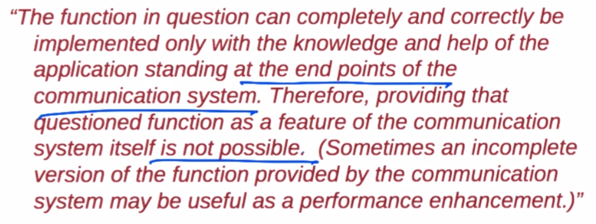

## Internet Design Principles

**Reading: Design Philosophy of the DARPA Internet Protocols - Dave Clark 1988**

**Conceptual Lessons**
* Principals designed for a certain type of network
* Todays problems are mostly because of original design decisions

**Technical Lessons**
* Packet Switching
* Fate Sharing

### Design Goal of Networking
*****Multiplexed*** virtualization of existing ***interconnected*** networks**
* Statistical multiplexing/packet switching - designed to solve the sharing problem
* Narrow Waist - designed to solve interconnection problem

### Packet Switching
* Information for forwarding traffic contained in destination address of packet
  * works like post office
  * No state defined ahead of time
  * Best effort send/receive
  * Never get a "busy signal"
  * Greater chance of lost data

### Narrow Waist
* Interconnect many existing networks & Hide underlying technology from applications
  * Every Internet device must "speak" IP - network layer
  * Transport layer - udp/tcp - on top of Network layer
    * network layer guarantees end to end connectivity to transport layer
  * Application layer on top of Transport layer
    * Transport layer guarantees reliable transport and congestion control to Application layer
  * Link layer - Ethernet - Below network layer
    * Link layer guarantees point2point connectivity to Network Layer
  * Physical Layer - Hardware
* IP is the "narrow waist" or bottleneck b/c all devices MUST speak IP - its the only protocol at Network layer

### Goals
* Interconnection
* Sharing
* Survivability: network works even if some devices fail
  * replication
    * keep state at multiple places so there is a replica waiting to take over
  * fate sharing
    * acceptible to lose state information for entity if that entity's connection is lost
    * Easier to withstand complex failures
    * Easier engineering
    * NAT violates fate sharing
* Heterogeneity: TCP/IP
  * Streaming, DNS, don't need reliability so don't necessarily need TCP
  * Best effort service model - packets are not necessarily delivered in order
* Distributed management
  * Addressing: routing registries (ARIN, RIPE, etc)
  * DNS: allows for name management
  * Routing: BGP allows configuration of your own routing policy
  * Downside: Internet has no owner - difficult to determine where problems are
  * Cost - this goal was accomplished 
  * Ease of attachment - success in this goal
  * Accountability - not quite
* What is missing?
  * Security
  * Availability
  * Mobility
  * Scaling
  * etc...

### End-to-End Argument
* 
