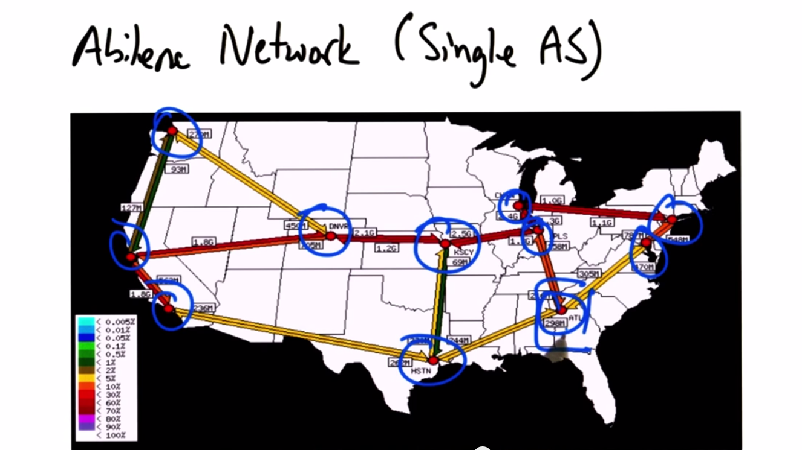
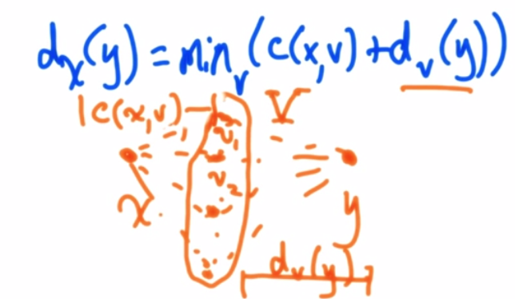
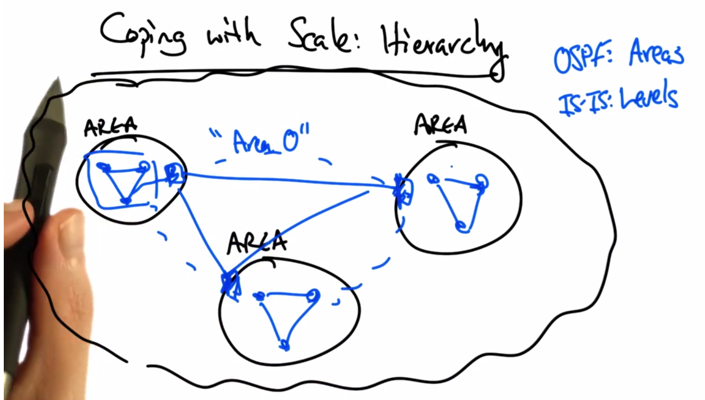

# Routing

** Internet is collection of multiple autonomous networks**

## Intradomain Routing
* Routing within an autonomous system

### Topology
* consists of:
  * Nodes ("PoPs")
  * Edges
  * 
  * GT connects at Sothern Crossroads (SOX) in Atlanta

### Distance Vector Routing
* Each node sends "vectors" to neighbors (copies of own routing table)
* Routers compute costs to each destination based on shortest available path
  * Bellman-Ford
  * 
  * [Bellman-Ford Example](https://www.youtube.com/watch?v=00AAnwgl2DI) (video)
  * [Count to Infinity Problem](https://www.youtube.com/watch?v=_lAJyA70Z-o) (video)
* **RIP**
  * Circa 1982
  * Eges have unit cost
  * Infinity = 16
  * slow convergence

* **Link-State**
  * Idea: Distribute Network Map
  * each node performs SPF computation
  * Initially:
    * add costs of immediate neighborys, D(v)
    * flood costs c(u,v) to neighbors
    * D(v)=min(c(v,w)+D(w),D(v)) - Dijkstra
  * OSPF - Open Shortest Path First
  * IS-IS - Int. System - Int. System
  * Link-State complexity grows with N^3
  * Coping with Scale: Hierarchy
  * 

## Interdomain Routing
**Routing between ASes**
* Each AS sends "Route Advertisements" to other ASes
  * Border Gateway Protocol - BGP
* Many attributes of BGP:
  1.  Destination prefix
  2.  Next Hop IP - (usually border of adjacent AS)
  3.  AS Path - sequence of ASes to traverse get to destination
* 2 types of BGP
  * eBGP (external) - protocol to advertise between borders of separate ASes
  * iBGP (internal) - advertise external connections within an AS
* IGP: routes *inside* an AS to *internal* destinations
* iBGP: routes *inside* an AS to *external* destinations
* **BGP Route Selection**
  1.  Prefer higher "local preference" value - does not get transmitted between ASes
  2.  Shortest AS path length
  3.  Multi-Exit Discriminator (MED)
    * Lower values preferred
    * Only comparable among routes from same AS
  4.  Sortest IGP path -> "hot potato" routing
  5.  Tiebreak -> "most stable", or lowest router ID
* Local Preference
  * Operator manually configures routers to have lower/higher value to control outbound traffic
  * Useful for configuring primary/backup routes
  * community is a tag to specify a primary or backup path
* Multiple Exit Discrimination
  * Also manually configured on routers
  * Used to control inbound traffic
  * Mostly used for political reasons

### Interdomain Routing Business Models
* Ranking Rules:
  1. Customer relationships - business makes money by routing this path
  2. Peering relationships - free
  3. Provider relationships - provider is paid to route this path
* Filtering/Export rules
  * From customer: advertise to everyone
  * From provider: advertise to only customers
  * From peer: advertise to other customers

### Interdomain Routing can Oscillate
* [Oscillation Demonstration](https://www.youtube.com/watch?v=Cb5VSo6h5_0) (video)
